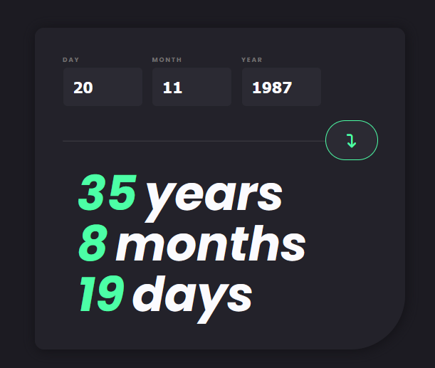

# Age Calculator App [Frontend Mentor Challenge]

-- The initial design and documentation are from [Frontend Mentor](https://www.frontendmentor.io) --

## Overview

The calculator features 3 input fields - day , month and year of birth.  
After inserting a valid input data and pressing the button, the app will calculate an age in years, months and days respectively based on the input date of birth.

App also includes animated age counter -  after pressing the button, resulting years, months and days will start at 0 and will continue to increment by one all the way to the result number.

Error handling features : 
- Input fields cannot be empty
- Input days are valid only in range 1-31
- Input months are valid only in range 1-12
- Input years are valid only in range 1900 - current year
- Non-existing dates, i.e. 30.02.1998 ...

